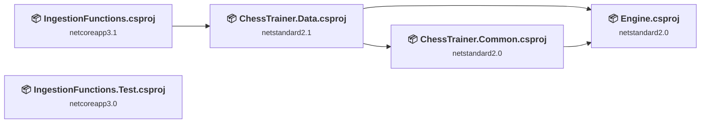
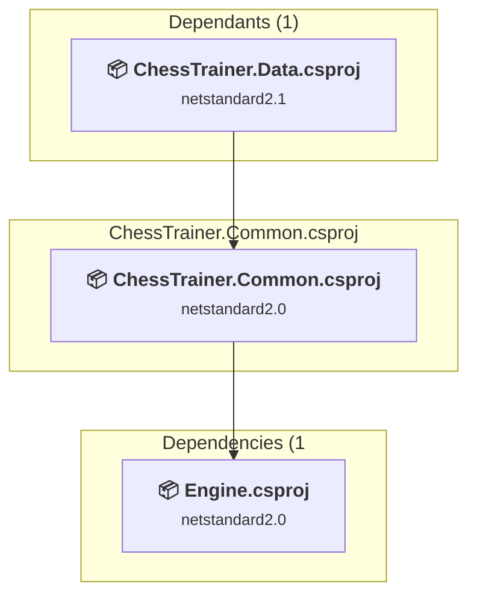
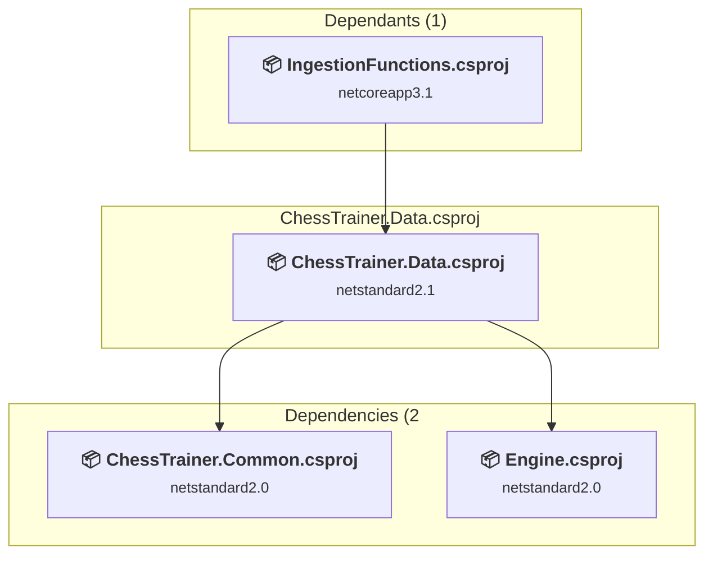
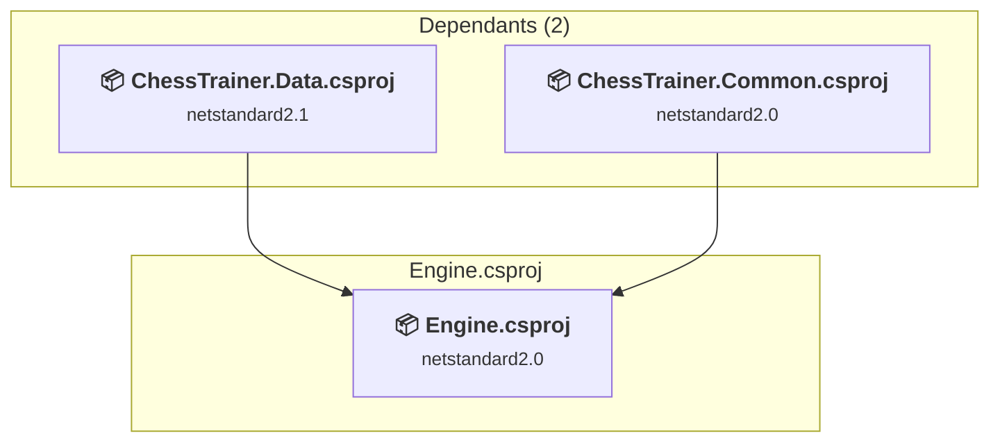
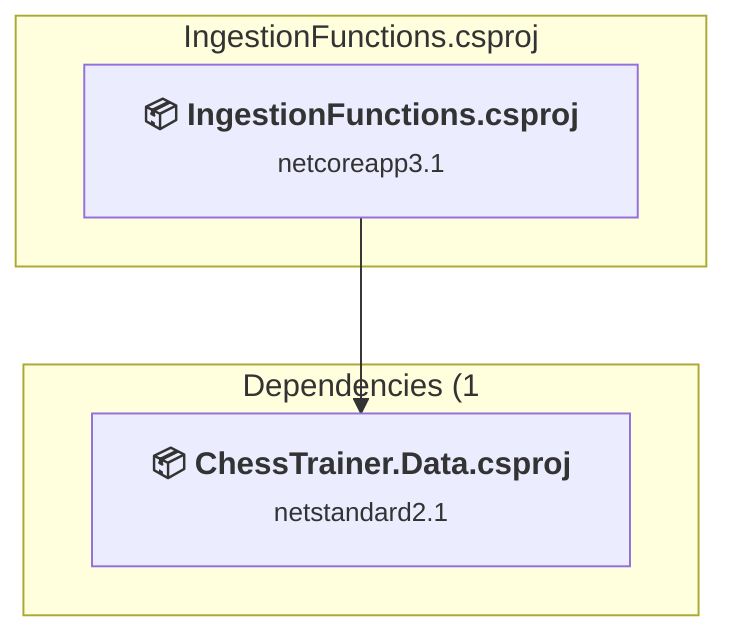
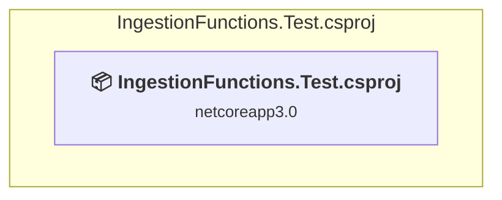

# Projects and dependencies analysis

This document provides a comprehensive overview of the projects and their dependencies in the context of upgrading to .NETCoreApp,Version=v10.0.

## Table of Contents

- [Executive Summary](#executive-Summary)
  - [Highlevel Metrics](#highlevel-metrics)
  - [Projects Compatibility](#projects-compatibility)
  - [Package Compatibility](#package-compatibility)
  - [API Compatibility](#api-compatibility)
  - [Binding Redirect Configuration](#binding-redirect-configuration)
- [Aggregate NuGet packages details](#aggregate-nuget-packages-details)
- [Top API Migration Challenges](#top-api-migration-challenges)
  - [Technologies and Features](#technologies-and-features)
  - [Most Frequent API Issues](#most-frequent-api-issues)
- [Projects Relationship Graph](#projects-relationship-graph)
- [Project Details](#project-details)

  - [src\ChessTrainer.Common\ChessTrainer.Common.csproj](#srcchesstrainercommonchesstrainercommoncsproj)
  - [src\ChessTrainer.Data\ChessTrainer.Data.csproj](#srcchesstrainerdatachesstrainerdatacsproj)
  - [src\Engine\Engine.csproj](#srcengineenginecsproj)
  - [src\IngestionFunctions\IngestionFunctions.csproj](#srcingestionfunctionsingestionfunctionscsproj)
  - [test\IngestionFunctions.Test\IngestionFunctions.Test.csproj](#testingestionfunctionstestingestionfunctionstestcsproj)

## Executive Summary

### Highlevel Metrics

| Metric | Count | Status |
| :--- | :---: | :--- |
| Total Projects | 5 | All require upgrade |
| Total NuGet Packages | 19 | 9 need upgrade |
| Total Code Files | 39 |  |
| Total Code Files with Incidents | 8 |  |
| Total Lines of Code | 3192 |  |
| Total Number of Issues | 25 |  |
| Estimated LOC to modify | 7+ | at least 0.2% of codebase |

### Projects Compatibility

| Project | Target Framework | Difficulty | Package Issues | API Issues | Binding Issues | Est. LOC Impact | Description |
| :--- | :---: | :---: | :---: | :---: | :---: | :---: | :--- |
| [src\ChessTrainer.Common\ChessTrainer.Common.csproj](#srcchesstrainercommonchesstrainercommoncsproj) | netstandard2.0 | 🟢 Low | 1 | 0 | 0 |  | ClassLibrary, Sdk Style = True |
| [src\ChessTrainer.Data\ChessTrainer.Data.csproj](#srcchesstrainerdatachesstrainerdatacsproj) | netstandard2.1 | 🟢 Low | 4 | 1 | 0 | 1+ | ClassLibrary, Sdk Style = True |
| [src\Engine\Engine.csproj](#srcengineenginecsproj) | netstandard2.0 | 🟢 Low | 1 | 0 | 0 |  | ClassLibrary, Sdk Style = True |
| [src\IngestionFunctions\IngestionFunctions.csproj](#srcingestionfunctionsingestionfunctionscsproj) | netcoreapp3.1 | 🟢 Low | 7 | 6 | 0 | 6+ | ClassLibrary, Sdk Style = True |
| [test\IngestionFunctions.Test\IngestionFunctions.Test.csproj](#testingestionfunctionstestingestionfunctionstestcsproj) | netcoreapp3.0 | 🟢 Low | 2 | 0 | 0 |  | ClassLibrary, Sdk Style = True |

### Package Compatibility

| Status | Count | Percentage |
| :--- | :---: | :---: |
| ✅ Compatible | 10 | 52.6% |
| ⚠️ Incompatible | 3 | 15.8% |
| 🔄 Upgrade Recommended | 6 | 31.6% |
| ***Total NuGet Packages*** | ***19*** | ***100%*** |

### API Compatibility

| Category | Count | Impact |
| :--- | :---: | :--- |
| 🔴 Binary Incompatible | 0 | High - Require code changes |
| 🟡 Source Incompatible | 3 | Medium - Needs re-compilation and potential conflicting API error fixing |
| 🔵 Behavioral change | 4 | Low - Behavioral changes that may require testing at runtime |
| ✅ Compatible | 3789 |  |
| ***Total APIs Analyzed*** | ***3796*** |  |

## Aggregate NuGet packages details

| Package | Current Version | Suggested Version | Projects | Description |
| :--- | :---: | :---: | :--- | :--- |
| AutoMapper.Extensions.ExpressionMapping | 3.1.0-preview01 |  | [ChessTrainer.Data.csproj](#srcchesstrainerdatachesstrainerdatacsproj) | ✅Compatible |
| AutoMapper.Extensions.Microsoft.DependencyInjection | 7.0.0 |  | [ChessTrainer.Data.csproj](#srcchesstrainerdatachesstrainerdatacsproj) | ✅Compatible |
| Azure.Storage.Queues | 12.2.0 | 12.26.0 | [IngestionFunctions.csproj](#srcingestionfunctionsingestionfunctionscsproj) | NuGet package contains security vulnerability |
| coverlet.collector | 1.0.1 |  | [IngestionFunctions.Test.csproj](#testingestionfunctionstestingestionfunctionstestcsproj) | ✅Compatible |
| Microsoft.Azure.Cosmos.Table | 1.0.6 |  | [IngestionFunctions.csproj](#srcingestionfunctionsingestionfunctionscsproj) | ⚠️NuGet package is deprecated |
| Microsoft.Azure.Functions.Extensions | 1.0.0 |  | [IngestionFunctions.csproj](#srcingestionfunctionsingestionfunctionscsproj) | ✅Compatible |
| Microsoft.Azure.WebJobs.Extensions.Storage | 3.0.10 |  | [IngestionFunctions.csproj](#srcingestionfunctionsingestionfunctionscsproj) | NuGet package functionality is included with framework reference |
| Microsoft.CodeAnalysis.FxCopAnalyzers | 2.6.2 |  | [ChessTrainer.Common.csproj](#srcchesstrainercommonchesstrainercommoncsproj) [ChessTrainer.Data.csproj](#srcchesstrainerdatachesstrainerdatacsproj) [Engine.csproj](#srcengineenginecsproj) [IngestionFunctions.csproj](#srcingestionfunctionsingestionfunctionscsproj) [IngestionFunctions.Test.csproj](#testingestionfunctionstestingestionfunctionstestcsproj) | ⚠️NuGet package is deprecated |
| Microsoft.EntityFrameworkCore.Design | 3.1.1 | 10.0.8 | [ChessTrainer.Data.csproj](#srcchesstrainerdatachesstrainerdatacsproj) | NuGet package upgrade is recommended |
| Microsoft.EntityFrameworkCore.SqlServer | 3.1.1 | 10.0.8 | [ChessTrainer.Data.csproj](#srcchesstrainerdatachesstrainerdatacsproj) | NuGet package upgrade is recommended |
| Microsoft.Extensions.Configuration | 3.1.1 | 10.0.8 | [ChessTrainer.Data.csproj](#srcchesstrainerdatachesstrainerdatacsproj) | NuGet package upgrade is recommended |
| Microsoft.Extensions.Http | 3.1.2 | 10.0.8 | [IngestionFunctions.csproj](#srcingestionfunctionsingestionfunctionscsproj) | NuGet package upgrade is recommended |
| Microsoft.Extensions.Http.Polly | 3.1.2 | 10.0.8 | [IngestionFunctions.csproj](#srcingestionfunctionsingestionfunctionscsproj) | NuGet package upgrade is recommended |
| Microsoft.NET.Sdk.Functions | 3.0.3 |  | [IngestionFunctions.csproj](#srcingestionfunctionsingestionfunctionscsproj) | Needs to be replaced with Replace with new package Microsoft.Azure.Functions.Worker.Extensions.Http=3.3.0;Microsoft.Azure.Functions.Worker.Sdk=2.0.7;Microsoft.Azure.Functions.Worker=2.52.0 |
| Microsoft.NET.Test.Sdk | 16.2.0 |  | [IngestionFunctions.Test.csproj](#testingestionfunctionstestingestionfunctionstestcsproj) | ✅Compatible |
| NETStandard.Library | 2.0.3 |  | [ChessTrainer.Common.csproj](#srcchesstrainercommonchesstrainercommoncsproj) [Engine.csproj](#srcengineenginecsproj) | ✅Compatible |
| StyleCop.Analyzers | 1.1.1-beta.61 |  | [ChessTrainer.Common.csproj](#srcchesstrainercommonchesstrainercommoncsproj) [ChessTrainer.Data.csproj](#srcchesstrainerdatachesstrainerdatacsproj) [Engine.csproj](#srcengineenginecsproj) [IngestionFunctions.csproj](#srcingestionfunctionsingestionfunctionscsproj) [IngestionFunctions.Test.csproj](#testingestionfunctionstestingestionfunctionstestcsproj) | ✅Compatible |
| xunit | 2.4.0 |  | [IngestionFunctions.Test.csproj](#testingestionfunctionstestingestionfunctionstestcsproj) | ⚠️NuGet package is deprecated |
| xunit.runner.visualstudio | 2.4.0 |  | [IngestionFunctions.Test.csproj](#testingestionfunctionstestingestionfunctionstestcsproj) | ✅Compatible |

## Top API Migration Challenges

### Technologies and Features

| Technology | Issues | Percentage | Migration Path |
| :--- | :---: | :---: | :--- |

### Most Frequent API Issues

| API | Count | Percentage | Category |
| :--- | :---: | :---: | :--- |
| M:System.TimeSpan.FromSeconds(System.Double) | 3 | 42.9% | Source Incompatible |
| T:System.Net.Http.HttpContent | 1 | 14.3% | Behavioral Change |
| M:System.Net.Http.HttpContent.ReadAsStreamAsync | 1 | 14.3% | Behavioral Change |
| T:System.Uri | 1 | 14.3% | Behavioral Change |
| M:System.Uri.#ctor(System.String) | 1 | 14.3% | Behavioral Change |

## Projects Relationship Graph

Legend:
📦 SDK-style project
⚙️ Classic project

## Project Details

### src\ChessTrainer.Common\ChessTrainer.Common.csproj

#### Project Info

- **Current Target Framework:** netstandard2.0✅
- **SDK-style**: True
- **Project Kind:** ClassLibrary
- **Dependencies**: 1
- **Dependants**: 1
- **Number of Files**: 7
- **Number of Files with Incidents**: 1
- **Lines of Code**: 194
- **Estimated LOC to modify**: 0+ (at least 0.0% of the project)

#### Dependency Graph

Legend:
📦 SDK-style project
⚙️ Classic project

### API Compatibility

| Category | Count | Impact |
| :--- | :---: | :--- |
| 🔴 Binary Incompatible | 0 | High - Require code changes |
| 🟡 Source Incompatible | 0 | Medium - Needs re-compilation and potential conflicting API error fixing |
| 🔵 Behavioral change | 0 | Low - Behavioral changes that may require testing at runtime |
| ✅ Compatible | 326 |  |
| ***Total APIs Analyzed*** | ***326*** |  |

### src\ChessTrainer.Data\ChessTrainer.Data.csproj

#### Project Info

- **Current Target Framework:** netstandard2.1✅
- **SDK-style**: True
- **Project Kind:** ClassLibrary
- **Dependencies**: 2
- **Dependants**: 1
- **Number of Files**: 13
- **Number of Files with Incidents**: 2
- **Lines of Code**: 605
- **Estimated LOC to modify**: 1+ (at least 0.2% of the project)

#### Dependency Graph

Legend:
📦 SDK-style project
⚙️ Classic project

### API Compatibility

| Category | Count | Impact |
| :--- | :---: | :--- |
| 🔴 Binary Incompatible | 0 | High - Require code changes |
| 🟡 Source Incompatible | 1 | Medium - Needs re-compilation and potential conflicting API error fixing |
| 🔵 Behavioral change | 0 | Low - Behavioral changes that may require testing at runtime |
| ✅ Compatible | 791 |  |
| ***Total APIs Analyzed*** | ***792*** |  |

### src\Engine\Engine.csproj

#### Project Info

- **Current Target Framework:** netstandard2.0✅
- **SDK-style**: True
- **Project Kind:** ClassLibrary
- **Dependencies**: 0
- **Dependants**: 2
- **Number of Files**: 9
- **Number of Files with Incidents**: 1
- **Lines of Code**: 1799
- **Estimated LOC to modify**: 0+ (at least 0.0% of the project)

#### Dependency Graph

Legend:
📦 SDK-style project
⚙️ Classic project

### API Compatibility

| Category | Count | Impact |
| :--- | :---: | :--- |
| 🔴 Binary Incompatible | 0 | High - Require code changes |
| 🟡 Source Incompatible | 0 | Medium - Needs re-compilation and potential conflicting API error fixing |
| 🔵 Behavioral change | 0 | Low - Behavioral changes that may require testing at runtime |
| ✅ Compatible | 2055 |  |
| ***Total APIs Analyzed*** | ***2055*** |  |

### src\IngestionFunctions\IngestionFunctions.csproj

#### Project Info

- **Current Target Framework:** netcoreapp3.1
- **Proposed Target Framework:** net10.0
- **SDK-style**: True
- **Project Kind:** ClassLibrary
- **Dependencies**: 1
- **Dependants**: 0
- **Number of Files**: 9
- **Number of Files with Incidents**: 3
- **Lines of Code**: 581
- **Estimated LOC to modify**: 6+ (at least 1.0% of the project)

#### Dependency Graph

Legend:
📦 SDK-style project
⚙️ Classic project

### API Compatibility

| Category | Count | Impact |
| :--- | :---: | :--- |
| 🔴 Binary Incompatible | 0 | High - Require code changes |
| 🟡 Source Incompatible | 2 | Medium - Needs re-compilation and potential conflicting API error fixing |
| 🔵 Behavioral change | 4 | Low - Behavioral changes that may require testing at runtime |
| ✅ Compatible | 617 |  |
| ***Total APIs Analyzed*** | ***623*** |  |

### test\IngestionFunctions.Test\IngestionFunctions.Test.csproj

#### Project Info

- **Current Target Framework:** netcoreapp3.0
- **Proposed Target Framework:** net10.0
- **SDK-style**: True
- **Project Kind:** ClassLibrary
- **Dependencies**: 0
- **Dependants**: 0
- **Number of Files**: 1
- **Number of Files with Incidents**: 1
- **Lines of Code**: 13
- **Estimated LOC to modify**: 0+ (at least 0.0% of the project)

#### Dependency Graph

Legend:
📦 SDK-style project
⚙️ Classic project

### API Compatibility

| Category | Count | Impact |
| :--- | :---: | :--- |
| 🔴 Binary Incompatible | 0 | High - Require code changes |
| 🟡 Source Incompatible | 0 | Medium - Needs re-compilation and potential conflicting API error fixing |
| 🔵 Behavioral change | 0 | Low - Behavioral changes that may require testing at runtime |
| ✅ Compatible | 0 |  |
| ***Total APIs Analyzed*** | ***0*** |  |

