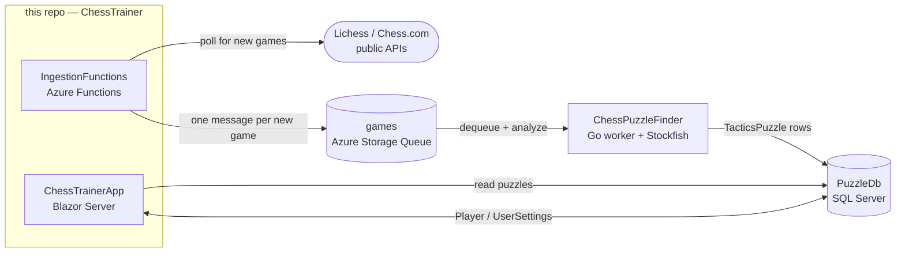

# ChessTrainer

A web app for practicing chess tactics drawn from real games. ChessTrainer
ingests games from Lichess and Chess.com, hands them to a companion worker
([mjrousos/ChessPuzzleFinder](https://github.com/mjrousos/ChessPuzzleFinder))
that analyzes them with Stockfish, and serves the resulting one-move tactics
back to you as puzzles to solve.

## What it does

- **Pick a player you want to learn from** — yourself, a friend, or a strong
  player whose games you'd like to study. ChessTrainer tracks their public
  games on Lichess and Chess.com.
- **Get tactics puzzles drawn from those real games.** Each puzzle is a
  position where one side missed a clearly winning tactic; you're asked to
  find the move they should have played.
- **Sign in** to save your "preferred players" and have puzzles come
  preferentially from their games. Anonymous users get puzzles drawn from
  the full corpus.
- **`/play`** — a freeform board for playing against the in-house chess
  engine (move validation only — not a strong engine; see
  [#35](https://github.com/mjrousos/ChessTrainer/issues/35)).

## How it works

ChessTrainer is one of three cooperating pieces. Game ingestion lives here;
puzzle extraction lives in a separate repo; both share a SQL database and an
Azure Storage Queue.



The companion repository
[**mjrousos/ChessPuzzleFinder**](https://github.com/mjrousos/ChessPuzzleFinder)
is the Go worker that consumes the `games` queue, replays each game
through a UCI engine (Stockfish), decides which positions contain a clear
missed tactic, and writes the resulting puzzles back into the shared
`PuzzleDb`. This repository does **not** contain the puzzle-extraction logic
— it produces the input (games) and consumes the output (puzzles), with
ChessPuzzleFinder in between.

### End-to-end data flow

1. A player is registered for tracking (via the Functions HTTP API, the
   queue trigger, or the daily timer in `IngestionFunctions`).
2. `IngestionFunctions` calls the Lichess / Chess.com APIs to find games
   newer than the last-seen checkpoint stored in an Azure Table for that
   player.
3. Each new game is written as an `IngestionRequest` (full UCI move list +
   metadata) onto the `games` Azure Storage Queue.
4. **ChessPuzzleFinder** (separate repo) dequeues each game, replays it
   through Stockfish, and writes any tactics it finds into the
   `TacticsPuzzle` table.
5. The Blazor app (`ChessTrainerApp`) queries that table and serves random
   puzzles, filtered by the user's preferred players when they're signed in.

## Repository layout

| Path | What it is |
|---|---|
| `src/ChessTrainerApp/` | Blazor Server web app + sign-in UI (root namespace `MjrChess.Trainer`). |
| `src/ChessTrainer.Data/` | EF Core data layer — `PuzzleDbContext`, repositories, migrations, AutoMapper profile. |
| `src/ChessTrainer.Common/` | Public domain models (`Player`, `TacticsPuzzle`, `UserSettings`, `PuzzleHistory`, …). |
| `src/Engine/` | In-house chess move generator / validator (`ChessEngine`). Used for board interactions, *not* for evaluation. |
| `src/IngestionFunctions/` | Azure Functions (isolated worker) that discovers games. **See its [README](src/IngestionFunctions/README.md) for a full local-dev walkthrough.** |
| `test/` | xUnit test projects for the app, data, and ingestion projects. |
| `infrastructure/ChessTrainerRG/` | ARM templates for Azure deployment. |
| `.github/copilot-instructions.md` | Project conventions and codebase tour for AI assistants (humans welcome too). |

## Getting started

### Prerequisites

| Tool | Version | Notes |
|---|---|---|
| .NET SDK | **10.0.x** | Pinned in [`global.json`](global.json). |
| Node.js | LTS | Needed for the webpack front-end build. |
| SQL Server | any recent | SQL Server 2022 in Docker is recommended; LocalDB also works (the default connection string in `appsettings.json` points at LocalDB). |
| Azure Functions Core Tools v4 + Docker | optional | Only if you want to run `IngestionFunctions` locally. See its [README](src/IngestionFunctions/README.md) for the full recipe (Azurite + SQL container + `func start`). |

### Clone and build

```powershell
git clone https://github.com/mjrousos/ChessTrainer.git
cd ChessTrainer

# Full build + tests. Webpack runs automatically via an MSBuild target the
# first time wwwroot/dist is missing.
dotnet build ChessTrainer.sln -c Release
dotnet test  ChessTrainer.sln -c Release
```

> Use Release at least once before declaring a change done — it flips on
> `TreatWarningsAsErrors`, so any new warning fails the build. See
> [`.github/copilot-instructions.md`](.github/copilot-instructions.md) for
> the project-wide build-hygiene rules.

### Apply the database schema

EF Core migrations live in `src/ChessTrainer.Data/Migrations/`. The
design-time factory reads the `PuzzleDbConnectionString` environment variable
and falls back to a local SQL container connection string when it isn't set,
so no startup project is required:

```powershell
# Defaults to a local SQL container on localhost:1433 — see
# src/IngestionFunctions/README.md for the `docker run` line.
dotnet ef database update --project src/ChessTrainer.Data

# Or point at LocalDB / another instance:
$env:PuzzleDbConnectionString = "Server=(localdb)\mssqllocaldb;Database=TacticsPuzzles;Trusted_Connection=True;MultipleActiveResultSets=true"
dotnet ef database update --project src/ChessTrainer.Data
```

### Run the web app

```powershell
dotnet run --project src/ChessTrainerApp
```

The site listens on the URLs Kestrel prints to the console. With an empty
database you'll see "no puzzles" — that's expected; you need the ingestion
side **and** the ChessPuzzleFinder worker running (against the same DB +
queue) to populate puzzles end-to-end.

> **Sign-in is currently broken.** The app is wired to an Azure AD B2C
> tenant whose OIDC metadata endpoint no longer responds, so attempting to
> sign in throws at startup. Anonymous puzzle-solving still works; auth
> migration to Microsoft Entra External ID is tracked in
> [#39](https://github.com/mjrousos/ChessTrainer/issues/39).

### Run the ingestion functions (optional)

Only needed if you want to populate puzzles end-to-end yourself. The
[`src/IngestionFunctions/README.md`](src/IngestionFunctions/README.md) walks
through Azurite + SQL Server in Docker + `func start`, including how to
invoke each function. Treat it as the source of truth for that side.

### Run the puzzle finder (separate repo)

The `games` queue is consumed by the companion Go worker — see
[**mjrousos/ChessPuzzleFinder**](https://github.com/mjrousos/ChessPuzzleFinder)
for its build and run instructions (Go + Stockfish + same SQL DB + same
Azure Storage account).

## Developer notes

- **Front-end assets** live under `src/ChessTrainerApp/app/` (SCSS + JS,
  built on Material Components Web) and are bundled by webpack into
  `src/ChessTrainerApp/wwwroot/dist/`. `Program.cs` sets
  `UseWebRoot("wwwroot/dist")`, so that's where the runtime serves static
  files from — don't hand-edit `wwwroot/dist`.
- **Models are duplicated by design.** `ChessTrainer.Data` exposes public
  domain models (`MjrChess.Trainer.Models.*` in `ChessTrainer.Common`)
  while keeping its EF entities (`MjrChess.Trainer.Data.Models.*`)
  internal to the data layer. AutoMapper bridges between them; don't leak
  `Data.Models.*` types out of `ChessTrainer.Data`.
- **The same SQL DB has two configuration keys.** The web app reads
  `ConnectionStrings:PuzzleDatabase`; `IngestionFunctions` reads the
  `PuzzleDbConnectionString` environment variable. Update both when
  changing connection details.
- **Tests** — xUnit + Coverlet on .NET 10. Run a single test with
  `dotnet test test/<Project> --filter "FullyQualifiedName~Class.Method"`.

## Deployment

Production deployment uses the ARM templates under
[`infrastructure/ChessTrainerRG/`](infrastructure/ChessTrainerRG/) — see
`Deployment.md` in that folder for the current procedure. Modernization to
Bicep + GitHub Actions is tracked in
[#31](https://github.com/mjrousos/ChessTrainer/issues/31).

## Roadmap

See the [issues list](https://github.com/mjrousos/ChessTrainer/issues) for
in-flight work — bug fixes, platform improvements, and product features.

## License

MIT — see [`LICENSE.txt`](LICENSE.txt).
